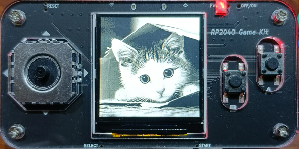

# rp2040-game-kit 的 bsp
## 硬件

硬件介绍：[基于树莓派RP2040的嵌入式系统学习平台 - 电子森林 (eetree.cn)](https://www.eetree.cn/project/detail/698)

官方仓库：[EETree-git/RP2040_Game_Kit: 基于树莓派RP2040的游戏机 (github.com)](https://github.com/EETree-git/RP2040_Game_Kit)

## 开发环境

**windows 11**

**Visual Studio Code** + **PlatformIO**

## 平台及框架

**Raspberry Pi Pico** + **Arduino**

## 其他

**[test/demo_TFT.cpp](test/demo_TFT.cpp)**

	TFT-eSPI 的测试代码

---

**[test/midi2buzzer.py](test/midi2buzzer.py)**

	可用于转换 onlinesequencer.net schematic format 的乐谱

---

**[test/upload.py](test/upload.py)**

	当PIO的upload失效时，可用该脚本自动上传固件
	使用方法: Ctrl+Alt+T, 选择 upload using script

